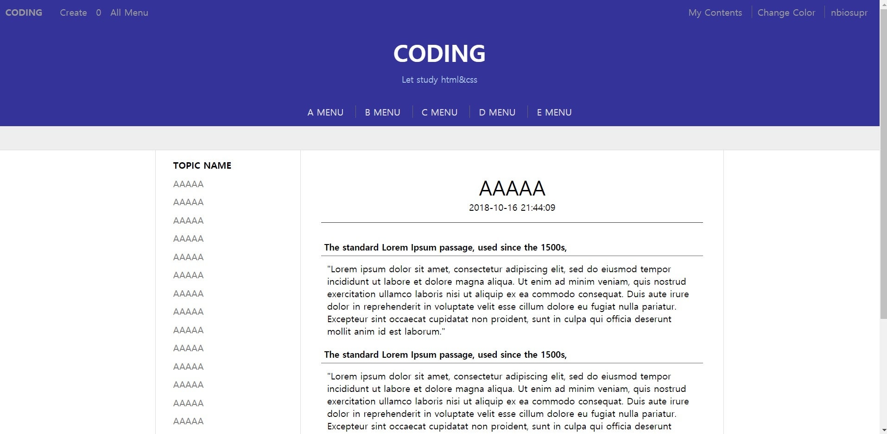

# Web Document to practice

I made this web-document to practice html, css, js

## Screenshot
{: width="400" }

## Description
Layout is [OpenTutorials](www.opentutorials.org) followed

Techniques used in this web-docment are below
- HTML
- CSS
- JavaScript (include JQuery)
